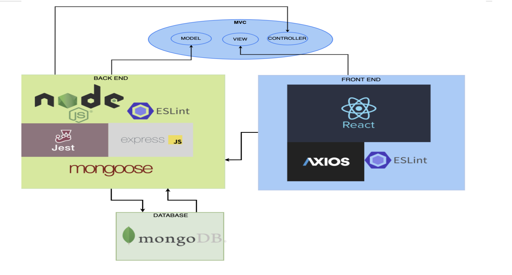

# TITULO DO PROJETO

**Ian Asenjo Dominguez Cunha,  iadcunha@sga.pucminas.br**

**Jully Ketely Alves da Silva,  jkasilva@sga.pucminas.br**

**Laura Lourdes Coutinho Rodrigues, laura.rodrigues.1199007@sga.pucminas.br**

**Lorrayne Reis Silva, lorrayne.silva.1220819@sga.pucminas.br**

**Warley Leandro dos Anjos, warley.anjos@sga.pucminas.br**

---

Professores:

**Jose Laerte Pires Xavier Junior**

**Cleiton Silva Tavares**

---

_Curso de Engenharia de Software, Unidade Praça da Liberdade_

_Instituto de Informática e Ciências Exatas – Pontifícia Universidade de Minas Gerais (PUC MINAS), Belo Horizonte – MG – Brasil_

---

_**Resumo**. Escrever aqui o resumo. O resumo deve contextualizar rapidamente o trabalho, descrever seu objetivo e, ao final, 
mostrar algum resultado relevante do trabalho (até 10 linhas)._

---

## Histórico de Revisões

| **Data** | **Autor** | **Descrição** | **Versão** |
| --- | --- | --- | --- |
| 03/09/2022|Lorrayne Reis |Desenvolvimento da apresentação referente as seções 1,1.1 e 1.2  | 1.0|
| 14/09/2022|Lorrayne Reis |Desenvolvimento da apresentação referente as seções  2 e 3 | 1.0|
| | | | |

## SUMÁRIO

1. [Apresentação](#apresentacao "Apresentação")  
	1.1. Problema  
	1.2. Objetivos do trabalho  
	1.3. Definições e Abreviaturas  

2. [Requisitos](#requisitos "Requisitos")  
'	2.1. Requisitos Funcionais  
	2.2. Requisitos Não-Funcionais  
	2.3. Restrições Arquiteturais  
	2.4. Mecanismos Arquiteturais  

3. [Modelagem](#modelagem "Modelagem e projeto arquitetural")  
	3.1. Visão de Negócio  
	3.2. Visão Lógica  
	3.3. Modelo de dados (opcional)  

4. [Avaliação](#avaliacao "Avaliação da Arquitetura")  
	4.1. Cenários  
	4.2. Avaliação  

5. [Referências](#referencias "REFERÊNCIAS") 

6. [Apêndices](#apendices "APÊNDICES") 

# 1. Apresentação

_No atual contexto pós pandêmico é indubitável a ascensão de pessoas no que tange a realização de viagens em território nacional,a partir de tal ponto observa-se um paradigma de câmbio estrutural de escolhas por parte dos viajantes como pela priorização de viagens mais curtas e como  principal meio locomotivo veículos de aluguel.Com essa prorrogação,quando em turismo tais visitantes desejam conhecer lugares como pontos turísticos, museus, realizar atividades culturais e começam a se preocupar com o planejamento da viagem muito antes do corrimento da mesma.Um exemplo da  afimação se mostra no aumento do consumo de conteúdos de viagem,em um documento divulgado pela Comscore, denominado "Travel Report" constatou-se o aumento de tempo do turista em sites de busca sobre locomoção,turismo e locação de fins de temporada.Isso demonstra uma mudança de paradigma do turista brasileiro no intuito de maior planejamento e na opção por explorar lugares de maneiras mais efetivas e em curto prazo._

## 1.1. Problema

_Um dos principais problemas enfrentados por viajantes diz respeito primeiramente a orquestração de suas atividades a serem realizadas quando estam viajando,uma vez que desejam conhecer muitos pontos que na maioria das vezes se localizam proximamente.Concisamente,os mesmos em sua maioria não possuem conhecimento de eventos ocorrentes na cidade em comparação a um nativo que conhece páginas de entretenimentos específicas de sua cidade.Segundamente,não existe uma fonte confiável de troca de informações entre pessoas conhecendo um mesmo local com tal contato sendo realizado através de grupos de Facebook,não tornando-se uma maneira segura de intercomunicação dado que pessoas podem se passar por outras ou fornecer informações errôneas._

## 1.2. Objetivos do trabalho

_O objetivo geral do trabalho é apresentar uma aplicação que possa fomentar ao usuários a criação de listas de roteiros turísticos que desejam realizar juntamente ao compartilhamento dessa a outras pessoas interessadas.Comitantemente a informatização de eventos ocorrentes na determinada localidade dos usuários e o fornecimento de uma chat para comunicação, no qual as pessoas poderão interagir para marcar encontros e compartilhar dicas._

## 1.3. Definições e Abreviaturas

Coloque aqui as definições, siglas e abreviaturas utilizadas no trabalho._

# 2. Requisitos

_Esta seção discorre sobre requisitos necessários para a implementação do projeto, de equivalência na contemplação da descrição arquitetural. Os mesmos foram divididos em requisitos funcionais e não funcionais, a seguir:_

## 2.1. Requisitos Funcionais

| **ID** | **Descrição** | **Prioridade** |
| --- | --- | --- |
| RF001 | O usuário deve autentificar-se pela web| Essencial|
| RF002 | O usuário deve autentificar-se através de seu telefone| Essencial |
| RF003| O utente poderá cadastrar roteiros de viagens| Essencial|
| RF004| Deve ser apresentado uma lista de exibição de roteiros aos usuários| Essencial |
| RF005| Deve ser apresentado  uma lista de estabelecimentos aos usuários| Essencial |
| RF006| Devem ser emitidas notificações informacionais |Desejável |
| RF007| O usuário poderá vizualizar sua localização| Essencial |

## 2.2. Requisitos Não-Funcionais

| **ID** | **Descrição** |
| --- | --- |
| RNF001 | O tempo de resposta realizar buscas de roteiros deve ser de 10 segundos|
| RNF002 | A plataforma deve armazenar os dados dos usuários de acordo com seu acesso|
| RNF003| Deve ser de fácil utilização|
| RNF004| Deve fornecer uma interface que vá de acordo com regras heurísticas de interação entre usuário e máquina|
| RNF005| As notificações devem ser emitidas com no mínimo 1 para a ocorrência do evento |
| RNF006| A plataforma deve apontar ao usuário caso a localização desse seja referente a uma distância de 5km ou mais do evento|
| RNF007| O usuário poderá cadastrar no máximo 10 roteiros de acordo com sua localidade|
| RNF008| Os componentes devem ser construídos de forma que possam ser reutilizados|

## 2.3. Restrições Arquiteturais

- A aplicação deve ser construída segundo a arquitetura MVC , na qual o frontend será desenvolvido em React;
- O aplicativo será funcional em dispositivos celulares Android e IOS os quais devem ter acesso a internet;
- O frontend deve ser desenvolvido para consumir diferentes serviços de APIs diferentes, portanto um módulo não pode interferir no outro;
- O serviço de autenticação de usuários será fornecido por uma API externa.

## 2.4. Mecanismos Arquiteturais

| **Análise** | **Design** | **Implementação** |
| --- | --- | --- |
| Persistência | Banco de dados não relacional| MongoDB|
| Front end |Interface de comunicação com o usuário |React, Axios, ESlint |
| Back end | Estruturação de operalização do sistema |Node, Eslint, Express Js, Mongoose|
| Integração |Controle de recursos com web e mobile | MVC|
| Log do sistema |Implementação dos recursos de log do componente de persistência| Jest|
| Teste de Software | Tratamento de exceções criando interações e cenários diferentes para usuários|Jest|
| Deploy |Configuração da IDE de deploy|Vs code |

# 3. Modelagem e projeto arquitetural

_Por meio do desenvolvimento em seguimento a utilização do padrão MVC, no qual o back-end composto é responsável por acionar uma ação no controller da aplicação, tendo  esse acesso anteriormente ao model,socilitando de forma não direta ações na view ou seja o front-end da aplicação.Não obstante destaque-se a relação entre a parte estrutural de entrada e saída de dados em conexão com o banco de dados._

**Figura 1 - Visão Geral da Solução**

## 3.1. Visão de Negócio (Funcionalidades)

1. O sistema deve realizar autenticação do usuário ( Web e Mobile).
2. O sistema deve oferecer o cadastro de roteiros.
3. O sistema deve oferecer o cadastro de estabelecimentos.
4. O sistema deve fazer a exibição de roteiros.
5. O sistema deve fazer a exibição de estabelecimentos.
6. Deve ser implementado um ambiente de interação entre os usuários.
7. Deve ser implementado  um serviço de notificações.
8. Deve ser implementado  um serviço de geolocalização.

### Descrição resumida dos Casos de Uso / Histórias de Usuário

Exemplos de resumo de Casos de Uso:

#### UC01 – REALIZAR LOGIN NA PLATAFORMA 01

| **Descrição** | Efetuar login na plataforma para utilizar recursos|
| --- | --- |
| **Atores** | Usuário|
| **Prioridade** | Essencial |
| **Requisitos associados** | RF001,RF002|
| **Fluxo Principal** |-|

#### UC02 – CADASTRAR ROTEIRO DE VIAGEM 02

| **Descrição** | Realizar o cadastramento de roteiros de viagens para que outros usuários possam vizualizar |
| --- | --- |
| **Atores** | Usuário |
| **Prioridade** | Essencial|
| **Requisitos associados** | RF003|
| **Fluxo Principal** | UC01|

#### UC03 – VIZUALIZAR ROTEIROS 03

| **Descrição** | Vizualizar roteiros referentes a localização geográfica próxima ou atráves de busca |
| --- | --- |
| **Atores** | Usuário|
| **Prioridade** | Essencial |
| **Requisitos associados** | RF004|
| **Fluxo Principal** | UC01 |

#### UC04 – LISTAR ESTABELECIMENTOS 04

| **Descrição** | |
| --- | --- |
| **Atores** | Usuário|
| **Prioridade** | Essencial|
| **Requisitos associados** | RF005|
| **Fluxo Principal** | UC1|

#### UC05 – VIZUALIZAR LOCALIZAÇAO 05

| **Descrição** | Vizualizar localização atual do utente|
| --- | --- |
| **Atores** |Usuário|
| **Prioridade** |Essencial |
| **Requisitos associados** | RF007|
| **Fluxo Principal** |UC1|

Exemplos de Histórias de Usuário:

- Como Camila eu quero criar roteiros para compartilhar informações de viagens com outras pessoas.

- Como João eu quero vizualizar uma lista de roteiros para escolher o que mais combina com o meu estilo de viagem.

- Como Priscila eu quero vizualizar a minha localização para me referenciar dentro das ocorrências de eventos próximas.

- Como Pedro eu quero logar em uma aplicação que seja mobile e app para ampliar meu repertório de possibilidades de acesso.

## 3.2. Visão Lógica

_Apresente os artefatos que serão utilizados descrevendo em linhas gerais as motivações que levaram a equipe a utilizar estes diagramas._

### Diagrama de Classes

**Figura 2 – Diagrama de classes (exemplo). Fonte: o próprio autor.**

Obs: Acrescente uma breve descrição sobre o diagrama apresentado na Figura 3.

### Diagrama de componentes

_Apresente o diagrama de componentes da aplicação, indicando, os elementos da arquitetura e as interfaces entre eles. Liste os estilos/padrões arquiteturais utilizados e faça uma descrição sucinta dos componentes indicando o papel de cada um deles dentro da arquitetura/estilo/padrão arquitetural. Indique também quais componentes serão reutilizados (navegadores, SGBDs, middlewares, etc), quais componentes serão adquiridos por serem proprietários e quais componentes precisam ser desenvolvidos._

**Figura 3 – Diagrama de Componentes (exemplo). Fonte: o próprio autor.**

_Apresente uma descrição detalhada dos artefatos que constituem o diagrama de implantação._

Ex: conforme diagrama apresentado na Figura X, as entidades participantes da solução são:

- **Componente 1** - Lorem ipsum dolor sit amet, consectetur adipiscing elit. Cras nunc magna, accumsan eget porta a, tincidunt sed mauris. Suspendisse orci nulla, sagittis a lorem laoreet, tincidunt imperdiet ipsum. Morbi malesuada pretium suscipit.
- **Componente 2** - Praesent nec nisi hendrerit, ullamcorper tortor non, rutrum sem. In non lectus tortor. Nulla vel tincidunt eros.

## 3.3. Modelo de dados (opcional)

_Caso julgue necessário para explicar a arquitetura, apresente o diagrama de classes ou diagrama de Entidade/Relacionamentos ou tabelas do banco de dados. Este modelo pode ser essencial caso a arquitetura utilize uma solução de banco de dados distribuídos ou um banco NoSQL._

 ")

**Figura 4 – Diagrama de Entidade Relacionamento (ER) - exemplo. Fonte: o próprio autor.**

Obs: Acrescente uma breve descrição sobre o diagrama apresentado na Figura 3.

# 4. Avaliação da Arquitetura

_Esta seção descreve a avaliação da arquitetura apresentada, baseada no método ATAM._

## 4.1. Cenários

_Apresente os cenários de testes utilizados na realização dos testes da sua aplicação. Escolha cenários de testes que demonstrem os requisitos não funcionais sendo satisfeitos. Os requisitos a seguir são apenas exemplos de possíveis requisitos, devendo ser revistos, adequados a cada projeto e complementados de forma a terem uma especificação completa e auto-explicativa._

**Cenário 1 - Acessibilidade:** Suspendisse consequat consectetur velit. Sed sem risus, dictum dictum facilisis vitae, commodo quis leo. Vivamus nulla sem, cursus a mollis quis, interdum at nulla. Nullam dictum congue mauris. Praesent nec nisi hendrerit, ullamcorper tortor non, rutrum sem. In non lectus tortor. Nulla vel tincidunt eros.

**Cenário 2 - Interoperabilidade:** Pellentesque habitant morbi tristique senectus et netus et malesuada fames ac turpis egestas. Fusce ut accumsan erat. Pellentesque in enim tempus, iaculis sem in, semper arcu.

**Cenário 3 - Manutenibilidade:** Phasellus magna tellus, consectetur quis scelerisque eget, ultricies eu ligula. Sed rhoncus fermentum nisi, a ullamcorper leo fringilla id. Nulla lacinia sem vel magna ornare, non tincidunt ipsum rhoncus. Nam euismod semper ante id tristique. Mauris vel elit augue.

**Cenário 4 - Segurança:** Suspendisse consectetur porta tortor non convallis. Sed lobortis erat sed dignissim dignissim. Nunc eleifend elit et aliquet imperdiet. Ut eu quam at lacus tincidunt fringilla eget maximus metus. Praesent finibus, sapien eget molestie porta, neque turpis congue risus, vel porttitor sapien tortor ac nulla. Aliquam erat volutpat.

## 4.2. Avaliação

_Apresente as medidas registradas na coleta de dados. O que não for possível quantificar apresente uma justificativa baseada em evidências qualitativas que suportam o atendimento do requisito não-funcional. Apresente uma avaliação geral da arquitetura indicando os pontos fortes e as limitações da arquitetura proposta._

| **Atributo de Qualidade:** | Segurança |
| --- | --- |
| **Requisito de Qualidade** | Acesso aos recursos restritos deve ser controlado |
| **Preocupação:** | Os acessos de usuários devem ser controlados de forma que cada um tenha acesso apenas aos recursos condizentes as suas credenciais. |
| **Cenários(s):** | Cenário 4 |
| **Ambiente:** | Sistema em operação normal |
| **Estímulo:** | Acesso do administrador do sistema as funcionalidades de cadastro de novos produtos e exclusão de produtos. |
| **Mecanismo:** | O servidor de aplicação (Rails) gera um _token_ de acesso para o usuário que se autentica no sistema. Este _token_ é transferido para a camada de visualização (Angular) após a autenticação e o tratamento visual das funcionalidades podem ser tratados neste nível. |
| **Medida de Resposta:** | As áreas restritas do sistema devem ser disponibilizadas apenas quando há o acesso de usuários credenciados. |

**Considerações sobre a arquitetura:**

| **Riscos:** | Não existe |
| --- | --- |
| **Pontos de Sensibilidade:** | Não existe |
| _ **Tradeoff** _ **:** | Não existe |

Evidências dos testes realizados

_Apresente imagens, descreva os testes de tal forma que se comprove a realização da avaliação._

# 5. REFERÊNCIAS

_Como um projeto da arquitetura de uma aplicação não requer revisão bibliográfica, a inclusão das referências não é obrigatória. No entanto, caso você deseje incluir referências relacionadas às tecnologias, padrões, ou metodologias que serão usadas no seu trabalho, relacione-as de acordo com a ABNT._

Verifique no link abaixo como devem ser as referências no padrão ABNT:

http://www.pucminas.br/imagedb/documento/DOC\_DSC\_NOME\_ARQUI20160217102425.pdf

**[1]** - _ELMASRI, Ramez; NAVATHE, Sham. **Sistemas de banco de dados**. 7. ed. São Paulo: Pearson, c2019. E-book. ISBN 9788543025001._

**[2]** - _COPPIN, Ben. **Inteligência artificial**. Rio de Janeiro, RJ: LTC, c2010. E-book. ISBN 978-85-216-2936-8._

**[3]** - _CORMEN, Thomas H. et al. **Algoritmos: teoria e prática**. Rio de Janeiro, RJ: Elsevier, Campus, c2012. xvi, 926 p. ISBN 9788535236996._

**[4]** - _SUTHERLAND, Jeffrey Victor. **Scrum: a arte de fazer o dobro do trabalho na metade do tempo**. 2. ed. rev. São Paulo, SP: Leya, 2016. 236, [4] p. ISBN 9788544104514._

**[5]** - _RUSSELL, Stuart J.; NORVIG, Peter. **Inteligência artificial**. Rio de Janeiro: Elsevier, c2013. xxi, 988 p. ISBN 9788535237016._

# 6. APÊNDICES

_Inclua o URL do repositório (Github, Bitbucket, etc) onde você armazenou o código da sua prova de conceito/protótipo arquitetural da aplicação como anexos. A inclusão da URL desse repositório de código servirá como base para garantir a autenticidade dos trabalhos._
